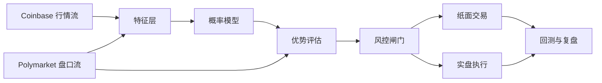

# Design: BTC 5分钟 Polymarket 机器人

## 核心判断

这个项目的目标不是“猜 BTC 涨跌”，而是“在当前 Polymarket 报价下，判断是否存在足够大的可交易优势”。

## 系统分层

## 第一版信号家族

1. 价格行为
   - 1 分钟与 5 分钟收益
   - 距离开盘基准价的偏离
   - 短窗波动率

2. 成交流
   - 近 30 秒买卖方向不平衡
   - 成交量突增

3. 市场错价
   - 模型概率和 Polymarket 买价的差
   - 费用后的净优势

## 第一版交易规则

- 若 `净优势 < 最小阈值`，不交易
- 若剩余时间太短，不交易
- 若流动性不足，不交易
- 单笔风险按资金比例封顶
- 先只做单边买入，不做复杂反手

## 第一版数据路线

1. Polymarket
   - 用时间戳推导当前窗口 slug
   - 用事件接口获取 Up / Down token
   - 用订单簿接口读取可执行报价

2. Coinbase Exchange
   - 先用公开分钟级 candles 构造价格行为特征
   - 后续再切换 WebSocket ticker / orderflow，减少延迟并增加成交流特征

## 历史验证口径

- 标签来自已结算 Polymarket 5 分钟窗口
- 每个样本统一在开窗后 60 秒做一次决策
- 特征只使用决策时刻已经完整结束的 1 分钟 K 线
- 先评估方向信息量，再补充真实盘口价格做可交易性回测

## 提升策略

- 先增加解释性强的价格行为特征
- 再用时间切分训练逻辑回归
- 单独跟踪高置信度样本的覆盖率与命中率
- 任何把训练集冲高、测试集掉队的方案都视为失败
- 分钟线模型到达平台期后，开始记录逐笔成交和盘口微结构特征

## 前向验证口径

- 纸面信号保留当时的入场价格、方向、仓位和特征
- 市场结算后再回填结果与 PnL
- 先积累真实前向样本，再决定是否值得接实盘

## 可执行价格回测口径

- 优先使用决策后 30 秒内真实发生的同方向 BUY 成交，作为可执行价格代理
- 若 30 秒内累计成交额不足目标下注金额，则该样本不计入成交
- 入场成本包含动态 taker fee
- 这仍然是代理回测，因为它复用的是历史成交，不含完整历史盘口深度

## Market-aware 建模口径

- 在决策时刻读取 `Up / Down` 历史价格
- 先评估“直接跟随更贵一侧”的市场基线
- 新模型只有在样本外胜过市场基线时，才算真正提供增量信息

## 暂时不做

- 不先上多代理共识
- 不先上强化学习
- 不先上高频追单
- 不先追求“全自动赚钱”的叙事

这些东西都可以以后加，但前提是基础优势已经被数据证明。
